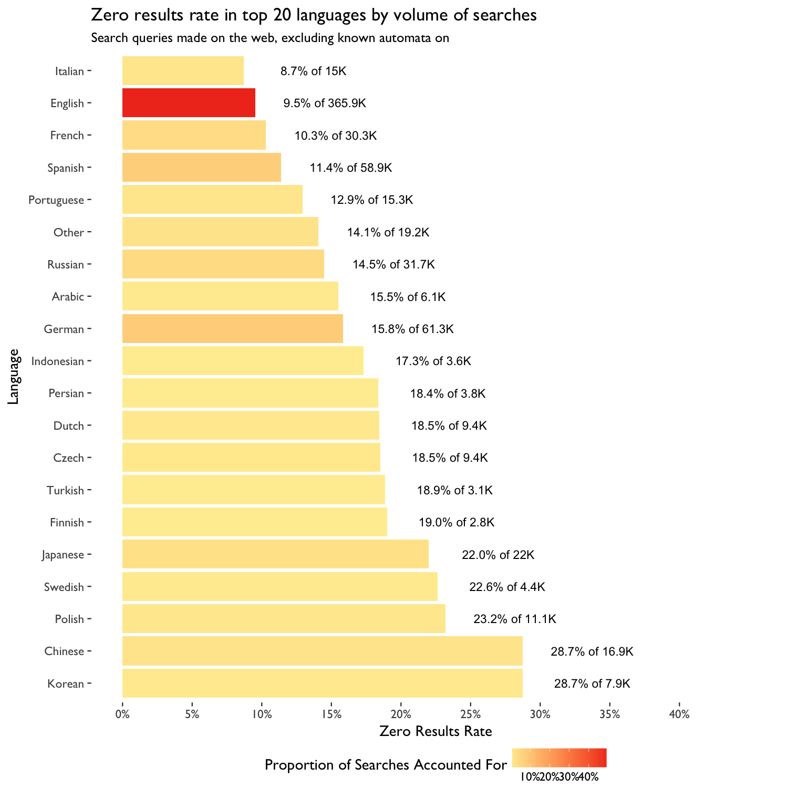
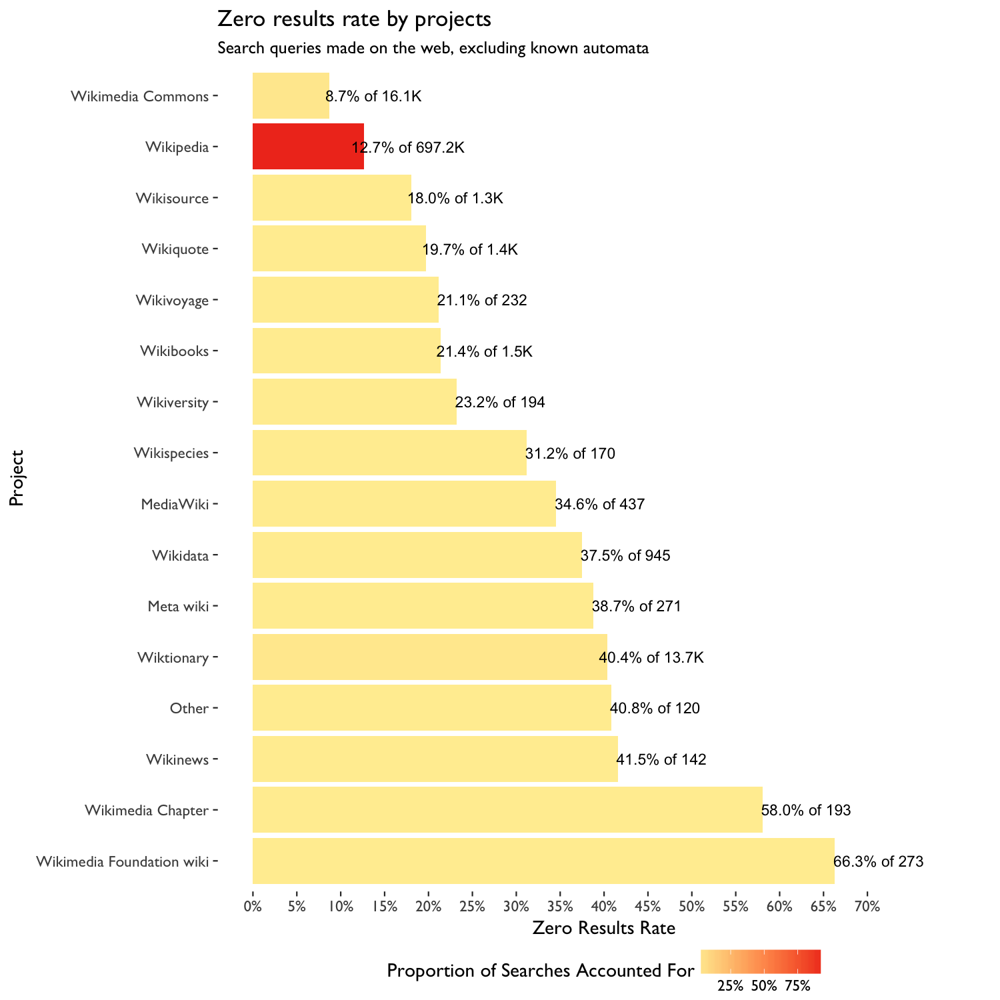
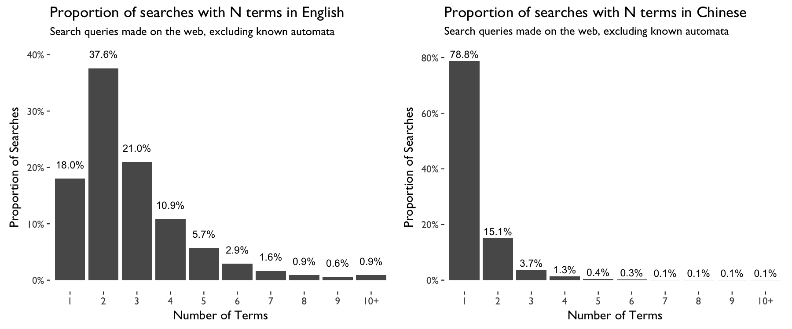

# More about number of features, number of terms and number of characters

### Breakdown by Number of Features per Query (Not counting "is simple")

|Query Type | Number of Features per Query| Queries with some results| Queries with zero results| Queries|
|:----------|----------------------------:|-------------------------:|-------------------------:|-------:|
|full_text  |                            0|                     88.7%|                     11.3%| 588.98K|
|full_text  |                            1|                     79.0%|                     21.0%|  142.1K|
|full_text  |                            2|                     76.1%|                     23.9%|   2.53K|
|full_text  |                            3|                     75.2%|                     24.8%|     500|
|full_text  |                            4|                     54.5%|                     45.5%|      11|
|full_text  |                            5|                     10.0%|                     90.0%|      10|

 

### Breakdown by Number of Terms per Query

|Query Type | Number of Terms per Query| Queries with some results| Queries with zero results| Queries|
|:----------|-------------------------:|-------------------------:|-------------------------:|-------:|
|full_text  |                         1|                     76.9%|                     23.1%| 196.67K|
|full_text  |                         2|                     92.6%|                      7.4%| 261.71K|
|full_text  |                         3|                     91.7%|                      8.3%| 131.87K|
|full_text  |                         4|                     89.6%|                     10.4%|  65.91K|
|full_text  |                         5|                     86.6%|                     13.4%|  34.61K|
|full_text  |                         6|                     83.2%|                     16.8%|  18.05K|
|full_text  |                         7|                     79.7%|                     20.3%|  10.28K|
|full_text  |                         8|                     76.2%|                     23.8%|    5.9K|
|full_text  |                         9|                     71.7%|                     28.3%|   3.66K|
|full_text  |                        10|                     63.8%|                     36.2%|   1.85K|
|full_text  |                        11|                     60.4%|                     39.6%|   1.08K|
|full_text  |                        12|                     61.2%|                     38.8%|     683|
|full_text  |                        13|                     57.3%|                     42.7%|     445|
|full_text  |                        14|                     54.8%|                     45.2%|     336|
|full_text  |                        15|                     47.5%|                     52.5%|     200|
|full_text  |                        16|                     49.7%|                     50.3%|     151|
|full_text  |                        17|                     39.0%|                     61.0%|     118|
|full_text  |                        18|                     35.3%|                     64.7%|     102|
|full_text  |                        19|                     40.0%|                     60.0%|      70|
|full_text  |                        20|                     42.3%|                     57.7%|      52|
|full_text  |                        21|                     45.2%|                     54.8%|      42|
|full_text  |                        22|                     37.5%|                     62.5%|      32|
|full_text  |                        23|                     29.0%|                     71.0%|      31|
|full_text  |                        24|                     38.1%|                     61.9%|      42|
|full_text  |                        25|                     56.5%|                     43.5%|      23|
|full_text  |                        26|                     25.0%|                     75.0%|      16|
|full_text  |                        27|                     42.9%|                     57.1%|      21|
|full_text  |                        28|                     62.5%|                     37.5%|      16|
|full_text  |                        29|                     14.3%|                     85.7%|      14|
|full_text  |                        30|                     41.2%|                     58.8%|      17|
|full_text  |                        31|                     26.7%|                     73.3%|      15|
|full_text  |                        32|                      9.1%|                     90.9%|      11|
|full_text  |                        33|                     18.2%|                     81.8%|      11|
|full_text  |                        34|                      0.0%|                    100.0%|       7|
|full_text  |                        35|                     37.5%|                     62.5%|       8|
|full_text  |                        36|                     25.0%|                     75.0%|      12|
|full_text  |                        37|                     25.0%|                     75.0%|      12|
|full_text  |                        38|                      0.0%|                    100.0%|       3|
|full_text  |                        39|                      0.0%|                    100.0%|       3|
|full_text  |                        40|                      0.0%|                    100.0%|       1|
|full_text  |                        41|                      0.0%|                    100.0%|       6|
|full_text  |                        42|                      0.0%|                    100.0%|       7|
|full_text  |                        43|                     25.0%|                     75.0%|       8|
|full_text  |                        44|                     20.0%|                     80.0%|       5|
|full_text  |                        45|                     25.0%|                     75.0%|       8|
|full_text  |                        46|                      0.0%|                    100.0%|       3|
|full_text  |                        47|                      0.0%|                    100.0%|       2|
|full_text  |                        49|                      0.0%|                    100.0%|       2|
|full_text  |                        50|                     20.0%|                     80.0%|       5|
|full_text  |                        51|                      0.0%|                    100.0%|       1|
|full_text  |                        52|                      0.0%|                    100.0%|       1|
|full_text  |                        54|                      0.0%|                    100.0%|       1|
|full_text  |                        55|                      0.0%|                    100.0%|       1|

 

### Breakdown by Number of Characters per Query

|Query Type | Number of Characters per Query| Queries with some results| Queries with zero results| Queries|
|:----------|------------------------------:|-------------------------:|-------------------------:|-------:|
|full_text  |                              0|                    100.0%|                      0.0%|       5|
|full_text  |                              1|                     86.9%|                     13.1%|     711|
|full_text  |                              2|                     92.5%|                      7.5%|   5.06K|
|full_text  |                              3|                     85.8%|                     14.2%|  11.16K|
|full_text  |                              4|                     84.3%|                     15.7%|  18.07K|
|full_text  |                              5|                     87.3%|                     12.7%|  22.13K|
|full_text  |                              6|                     86.5%|                     13.5%|  26.27K|
|full_text  |                              7|                     85.1%|                     14.9%|  29.44K|
|full_text  |                              8|                     82.6%|                     17.4%|  30.63K|
|full_text  |                              9|                     82.8%|                     17.2%|  33.09K|
|full_text  |                             10|                     84.6%|                     15.4%|  35.89K|
|full_text  |                             11|                     87.5%|                     12.5%|  38.99K|
|full_text  |                             12|                     89.4%|                     10.6%|  40.45K|
|full_text  |                             13|                     90.1%|                      9.9%|  40.03K|
|full_text  |                             14|                     90.3%|                      9.7%|  38.83K|
|full_text  |                             15|                     90.3%|                      9.7%|  35.91K|
|full_text  |                             16|                     90.3%|                      9.7%|  32.89K|
|full_text  |                             17|                     90.1%|                      9.9%|  30.11K|
|full_text  |                             18|                     90.3%|                      9.7%|  27.22K|
|full_text  |                             19|                     90.0%|                     10.0%|  24.02K|
|full_text  |                             20|                     89.6%|                     10.4%|  21.41K|
|full_text  |                             21|                     89.4%|                     10.6%|   19.7K|
|full_text  |                             22|                     88.9%|                     11.1%|  17.52K|
|full_text  |                             23|                     88.1%|                     11.9%|  15.68K|
|full_text  |                             24|                     88.5%|                     11.5%|  14.01K|
|full_text  |                             25|                     87.7%|                     12.3%|  12.65K|
|full_text  |                             26|                     86.3%|                     13.7%|  11.29K|
|full_text  |                             27|                     86.5%|                     13.5%|  10.12K|
|full_text  |                             28|                     86.1%|                     13.9%|   9.16K|
|full_text  |                             29|                     85.7%|                     14.3%|   8.14K|
|full_text  |                             30|                     84.8%|                     15.2%|    7.4K|
|full_text  |                             31|                     83.5%|                     16.5%|   6.53K|
|full_text  |                             32|                     84.0%|                     16.0%|   5.73K|
|full_text  |                             33|                     83.5%|                     16.5%|   5.05K|
|full_text  |                             34|                     83.6%|                     16.4%|   4.61K|
|full_text  |                             35|                     80.9%|                     19.1%|   4.31K|
|full_text  |                             36|                     82.5%|                     17.5%|   3.63K|
|full_text  |                             37|                     80.3%|                     19.7%|    3.4K|
|full_text  |                             38|                     80.0%|                     20.0%|   2.95K|
|full_text  |                             39|                     77.7%|                     22.3%|   2.62K|
|full_text  |                             40|                     79.9%|                     20.1%|   2.48K|
|full_text  |                             41|                     77.8%|                     22.2%|   2.19K|
|full_text  |                             42|                     77.3%|                     22.7%|      2K|
|full_text  |                             43|                     73.4%|                     26.6%|   1.85K|
|full_text  |                             44|                     73.3%|                     26.7%|   1.65K|
|full_text  |                             45|                     74.8%|                     25.2%|    1.5K|
|full_text  |                             46|                     72.8%|                     27.2%|   1.31K|
|full_text  |                             47|                     74.4%|                     25.6%|   1.15K|
|full_text  |                             48|                     72.1%|                     27.9%|   1.03K|
|full_text  |                             49|                     70.3%|                     29.7%|   1.01K|
|full_text  |                             50|                     71.6%|                     28.4%|     859|
|full_text  |                             51|                     69.0%|                     31.0%|     772|
|full_text  |                             52|                     68.5%|                     31.5%|     715|
|full_text  |                             53|                     67.3%|                     32.7%|     621|
|full_text  |                             54|                     67.3%|                     32.7%|     594|
|full_text  |                             55|                     63.7%|                     36.3%|     532|
|full_text  |                             56|                     60.6%|                     39.4%|     510|
|full_text  |                             57|                     64.1%|                     35.9%|     429|
|full_text  |                             58|                     58.6%|                     41.4%|     432|
|full_text  |                             59|                     59.9%|                     40.1%|     329|
|full_text  |                             60|                     64.6%|                     35.4%|     322|
|full_text  |                             61|                     60.7%|                     39.3%|     346|
|full_text  |                             62|                     61.5%|                     38.5%|     309|
|full_text  |                             63|                     58.0%|                     42.0%|     288|
|full_text  |                             64|                     56.2%|                     43.8%|     219|
|full_text  |                             65|                     56.6%|                     43.4%|     212|
|full_text  |                             66|                     62.6%|                     37.4%|     182|
|full_text  |                             67|                     59.6%|                     40.4%|     193|
|full_text  |                             68|                     51.6%|                     48.4%|     182|
|full_text  |                             69|                     53.1%|                     46.9%|     160|
|full_text  |                             70|                     52.3%|                     47.7%|     130|
|full_text  |                             71|                     57.3%|                     42.7%|     131|
|full_text  |                             72|                     52.2%|                     47.8%|     134|
|full_text  |                             73|                     45.7%|                     54.3%|     105|
|full_text  |                             74|                     46.7%|                     53.3%|     137|
|full_text  |                             75|                     51.6%|                     48.4%|      93|
|full_text  |                             76|                     40.5%|                     59.5%|      84|
|full_text  |                             77|                     51.6%|                     48.4%|      91|
|full_text  |                             78|                     50.0%|                     50.0%|      76|
|full_text  |                             79|                     41.9%|                     58.1%|      74|
|full_text  |                             80|                     37.7%|                     62.3%|      69|
|full_text  |                             81|                     46.9%|                     53.1%|      64|
|full_text  |                             82|                     51.8%|                     48.2%|      83|
|full_text  |                             83|                     50.0%|                     50.0%|      62|
|full_text  |                             84|                     41.8%|                     58.2%|      55|
|full_text  |                             85|                     38.7%|                     61.3%|      62|
|full_text  |                             86|                     48.3%|                     51.7%|      60|
|full_text  |                             87|                     44.7%|                     55.3%|      47|
|full_text  |                             88|                     35.3%|                     64.7%|      34|
|full_text  |                             89|                     36.7%|                     63.3%|      49|
|full_text  |                             90|                     55.6%|                     44.4%|      45|
|full_text  |                             91|                     51.6%|                     48.4%|      31|
|full_text  |                             92|                     43.8%|                     56.2%|      32|
|full_text  |                             93|                     23.1%|                     76.9%|      39|
|full_text  |                             94|                     32.5%|                     67.5%|      40|
|full_text  |                             95|                     39.4%|                     60.6%|      33|
|full_text  |                             96|                     45.5%|                     54.5%|      22|
|full_text  |                             97|                     25.0%|                     75.0%|      24|
|full_text  |                             98|                     31.8%|                     68.2%|      22|
|full_text  |                             99|                     44.0%|                     56.0%|      25|
|full_text  |                            100|                     42.9%|                     57.1%|      28|
|full_text  |                            101|                     32.1%|                     67.9%|      28|
|full_text  |                            102|                     25.0%|                     75.0%|      24|
|full_text  |                            103|                     33.3%|                     66.7%|      21|
|full_text  |                            104|                     27.8%|                     72.2%|      18|
|full_text  |                            105|                     25.0%|                     75.0%|      20|
|full_text  |                            106|                     40.7%|                     59.3%|      27|
|full_text  |                            107|                     40.9%|                     59.1%|      22|
|full_text  |                            108|                     29.2%|                     70.8%|      24|
|full_text  |                            109|                     65.0%|                     35.0%|      20|
|full_text  |                            110|                     33.3%|                     66.7%|      24|
|full_text  |                            111|                     47.4%|                     52.6%|      19|
|full_text  |                            112|                     46.2%|                     53.8%|      13|
|full_text  |                            113|                     40.0%|                     60.0%|      15|
|full_text  |                            114|                     57.9%|                     42.1%|      19|
|full_text  |                            115|                     26.7%|                     73.3%|      15|
|full_text  |                            116|                     36.4%|                     63.6%|      11|
|full_text  |                            117|                     50.0%|                     50.0%|      14|
|full_text  |                            118|                     33.3%|                     66.7%|      12|
|full_text  |                            119|                     28.6%|                     71.4%|       7|
|full_text  |                            120|                     31.6%|                     68.4%|      19|
|full_text  |                            121|                     37.5%|                     62.5%|       8|
|full_text  |                            122|                     60.0%|                     40.0%|      10|
|full_text  |                            123|                     55.6%|                     44.4%|       9|
|full_text  |                            124|                     50.0%|                     50.0%|      10|
|full_text  |                            125|                     22.2%|                     77.8%|       9|
|full_text  |                            126|                     33.3%|                     66.7%|       6|
|full_text  |                            127|                     11.1%|                     88.9%|       9|
|full_text  |                            128|                     22.7%|                     77.3%|      22|
|full_text  |                            129|                     28.6%|                     71.4%|       7|
|full_text  |                            130|                     14.3%|                     85.7%|       7|
|full_text  |                            131|                     37.5%|                     62.5%|       8|
|full_text  |                            132|                     75.0%|                     25.0%|       8|
|full_text  |                            134|                      0.0%|                    100.0%|       5|
|full_text  |                            135|                     27.3%|                     72.7%|      11|
|full_text  |                            136|                     16.7%|                     83.3%|       6|
|full_text  |                            137|                     13.3%|                     86.7%|      15|
|full_text  |                            138|                     66.7%|                     33.3%|      12|
|full_text  |                            139|                     33.3%|                     66.7%|       9|
|full_text  |                            140|                     10.0%|                     90.0%|      10|
|full_text  |                            141|                      0.0%|                    100.0%|       8|
|full_text  |                            142|                      0.0%|                    100.0%|       8|
|full_text  |                            143|                     40.0%|                     60.0%|       5|
|full_text  |                            144|                     66.7%|                     33.3%|       6|
|full_text  |                            145|                     42.9%|                     57.1%|       7|
|full_text  |                            146|                     20.0%|                     80.0%|       5|
|full_text  |                            147|                     33.3%|                     66.7%|       6|
|full_text  |                            148|                     83.3%|                     16.7%|       6|
|full_text  |                            149|                      0.0%|                    100.0%|       3|
|full_text  |                            150|                     36.4%|                     63.6%|      11|
|full_text  |                            151|                     70.0%|                     30.0%|      10|
|full_text  |                            152|                     16.7%|                     83.3%|       6|
|full_text  |                            153|                     50.0%|                     50.0%|       6|
|full_text  |                            154|                     22.2%|                     77.8%|       9|
|full_text  |                            155|                     50.0%|                     50.0%|       6|
|full_text  |                            156|                     50.0%|                     50.0%|       2|
|full_text  |                            157|                     28.6%|                     71.4%|       7|
|full_text  |                            158|                     25.0%|                     75.0%|       4|
|full_text  |                            159|                     40.0%|                     60.0%|       5|
|full_text  |                            160|                     33.3%|                     66.7%|       3|
|full_text  |                            161|                     10.0%|                     90.0%|      10|
|full_text  |                            162|                     12.5%|                     87.5%|       8|
|full_text  |                            163|                     40.0%|                     60.0%|       5|
|full_text  |                            164|                     20.0%|                     80.0%|       5|
|full_text  |                            165|                     33.3%|                     66.7%|       6|
|full_text  |                            166|                     25.0%|                     75.0%|       4|
|full_text  |                            167|                     33.3%|                     66.7%|       3|
|full_text  |                            168|                    100.0%|                      0.0%|       1|
|full_text  |                            169|                     25.0%|                     75.0%|       4|
|full_text  |                            170|                     16.7%|                     83.3%|       6|
|full_text  |                            171|                      0.0%|                    100.0%|       4|
|full_text  |                            172|                      0.0%|                    100.0%|       4|
|full_text  |                            173|                      0.0%|                    100.0%|       2|
|full_text  |                            174|                      0.0%|                    100.0%|       3|
|full_text  |                            175|                      0.0%|                    100.0%|       2|
|full_text  |                            176|                     25.0%|                     75.0%|       4|
|full_text  |                            177|                      0.0%|                    100.0%|       3|
|full_text  |                            178|                      0.0%|                    100.0%|       1|
|full_text  |                            179|                     25.0%|                     75.0%|       4|
|full_text  |                            180|                     33.3%|                     66.7%|       3|
|full_text  |                            181|                      0.0%|                    100.0%|       2|
|full_text  |                            182|                      0.0%|                    100.0%|       2|
|full_text  |                            183|                      0.0%|                    100.0%|       4|
|full_text  |                            184|                     33.3%|                     66.7%|       3|
|full_text  |                            185|                      0.0%|                    100.0%|       2|
|full_text  |                            186|                      0.0%|                    100.0%|       6|
|full_text  |                            187|                      0.0%|                    100.0%|       2|
|full_text  |                            189|                      0.0%|                    100.0%|       2|
|full_text  |                            190|                     33.3%|                     66.7%|       3|
|full_text  |                            191|                     60.0%|                     40.0%|       5|
|full_text  |                            192|                      0.0%|                    100.0%|       5|
|full_text  |                            193|                      0.0%|                    100.0%|       1|
|full_text  |                            194|                     20.0%|                     80.0%|       5|
|full_text  |                            195|                      0.0%|                    100.0%|       3|
|full_text  |                            197|                      0.0%|                    100.0%|       2|
|full_text  |                            198|                      0.0%|                    100.0%|       1|
|full_text  |                            199|                      0.0%|                    100.0%|       1|
|full_text  |                            200|                      0.0%|                    100.0%|       4|
|full_text  |                            201|                      0.0%|                    100.0%|       1|
|full_text  |                            203|                      0.0%|                    100.0%|       1|
|full_text  |                            204|                     50.0%|                     50.0%|       2|
|full_text  |                            205|                      0.0%|                    100.0%|       4|
|full_text  |                            206|                      0.0%|                    100.0%|       2|
|full_text  |                            207|                      0.0%|                    100.0%|       3|
|full_text  |                            208|                    100.0%|                      0.0%|       2|
|full_text  |                            209|                      0.0%|                    100.0%|       1|
|full_text  |                            210|                      0.0%|                    100.0%|       3|
|full_text  |                            211|                      0.0%|                    100.0%|       4|
|full_text  |                            213|                      0.0%|                    100.0%|       1|
|full_text  |                            214|                      0.0%|                    100.0%|       2|
|full_text  |                            215|                     33.3%|                     66.7%|       3|
|full_text  |                            216|                     50.0%|                     50.0%|       2|
|full_text  |                            217|                      0.0%|                    100.0%|       1|
|full_text  |                            218|                    100.0%|                      0.0%|       1|
|full_text  |                            219|                    100.0%|                      0.0%|       2|
|full_text  |                            220|                      0.0%|                    100.0%|       1|
|full_text  |                            221|                     33.3%|                     66.7%|       3|
|full_text  |                            222|                     50.0%|                     50.0%|       2|
|full_text  |                            223|                      0.0%|                    100.0%|       2|
|full_text  |                            224|                     33.3%|                     66.7%|       3|
|full_text  |                            225|                      0.0%|                    100.0%|       4|
|full_text  |                            226|                     50.0%|                     50.0%|       4|
|full_text  |                            227|                    100.0%|                      0.0%|       1|
|full_text  |                            229|                      0.0%|                    100.0%|       1|
|full_text  |                            230|                    100.0%|                      0.0%|       1|
|full_text  |                            231|                     33.3%|                     66.7%|       3|
|full_text  |                            232|                      0.0%|                    100.0%|       1|
|full_text  |                            233|                      0.0%|                    100.0%|       1|
|full_text  |                            234|                     33.3%|                     66.7%|       3|
|full_text  |                            235|                      0.0%|                    100.0%|       2|
|full_text  |                            236|                      0.0%|                    100.0%|       2|
|full_text  |                            237|                      0.0%|                    100.0%|       2|
|full_text  |                            238|                      0.0%|                    100.0%|       3|
|full_text  |                            239|                      0.0%|                    100.0%|       1|
|full_text  |                            240|                      0.0%|                    100.0%|       7|
|full_text  |                            243|                      0.0%|                    100.0%|       3|
|full_text  |                            244|                    100.0%|                      0.0%|       1|
|full_text  |                            245|                      0.0%|                    100.0%|       3|
|full_text  |                            246|                      0.0%|                    100.0%|       1|
|full_text  |                            247|                      0.0%|                    100.0%|       2|
|full_text  |                            249|                      0.0%|                    100.0%|       4|
|full_text  |                            250|                      0.0%|                    100.0%|       3|
|full_text  |                            251|                      0.0%|                    100.0%|       1|
|full_text  |                            252|                      0.0%|                    100.0%|       1|
|full_text  |                            253|                     20.0%|                     80.0%|       5|
|full_text  |                            254|                      0.0%|                    100.0%|       4|
|full_text  |                            255|                      0.0%|                    100.0%|       6|
|full_text  |                            256|                      0.0%|                    100.0%|      10|
|full_text  |                            257|                      0.0%|                    100.0%|       1|
|full_text  |                            258|                      0.0%|                    100.0%|       3|
|full_text  |                            260|                      0.0%|                    100.0%|       1|
|full_text  |                            261|                      0.0%|                    100.0%|       2|
|full_text  |                            262|                    100.0%|                      0.0%|       2|
|full_text  |                            264|                      0.0%|                    100.0%|       1|
|full_text  |                            265|                      0.0%|                    100.0%|       1|
|full_text  |                            268|                      0.0%|                    100.0%|       1|
|full_text  |                            269|                      0.0%|                    100.0%|       1|
|full_text  |                            277|                      0.0%|                    100.0%|       1|
|full_text  |                            281|                      0.0%|                    100.0%|       2|
|full_text  |                            285|                      0.0%|                    100.0%|       1|
|full_text  |                            286|                      0.0%|                    100.0%|       1|
|full_text  |                            287|                      0.0%|                    100.0%|       1|
|full_text  |                            290|                      0.0%|                    100.0%|       1|
|full_text  |                            292|                      0.0%|                    100.0%|       1|
|full_text  |                            295|                      0.0%|                    100.0%|       1|
|full_text  |                            296|                     50.0%|                     50.0%|       2|
|full_text  |                            298|                      0.0%|                    100.0%|       1|
|full_text  |                            338|                      0.0%|                    100.0%|       1|
|full_text  |                            379|                      0.0%|                    100.0%|       2|
|full_text  |                            389|                      0.0%|                    100.0%|       3|
|full_text  |                            390|                      0.0%|                    100.0%|       3|

 

### ZRR by languages and projects

*Languages/projects whose counts are less than 50 are labeled as "Other".*

### Proportion of Searches by Number of Terms per Query in Chinese and English

### Queries having non-ASCII by Languages

|Query Type |Language            |Queries with some results |Queries with zero results |Queries |
|:----------|:-------------------|:-------------------------|:-------------------------|:-------|
|full_text  |Russian             |87.1%                     |12.9%                     |26.67K  |
|full_text  |Japanese            |76.2%                     |23.8%                     |18.73K  |
|full_text  |English             |72.8%                     |27.2%                     |12.8K   |
|full_text  |Chinese             |66.9%                     |33.1%                     |11.55K  |
|full_text  |German              |80.8%                     |19.2%                     |8.36K   |
|full_text  |Spanish             |88.0%                     |12.0%                     |7.45K   |
|full_text  |Korean              |73.9%                     |26.1%                     |5.89K   |
|full_text  |French              |88.0%                     |12.0%                     |5.74K   |
|full_text  |Arabic              |89.0%                     |11.0%                     |5.04K   |
|full_text  |Czech               |83.3%                     |16.7%                     |4.86K   |
|full_text  |Portuguese          |86.1%                     |13.9%                     |3.98K   |
|full_text  |Polish              |73.1%                     |26.9%                     |3.52K   |
|full_text  |Persian             |85.0%                     |15.0%                     |2.92K   |
|full_text  |Ukrainian           |80.5%                     |19.5%                     |2.3K    |
|full_text  |Hebrew              |82.2%                     |17.8%                     |1.97K   |
|full_text  |Other               |68.4%                     |31.6%                     |1.78K   |
|full_text  |Greek               |81.7%                     |18.3%                     |1.78K   |
|full_text  |Vietnamese          |89.9%                     |10.1%                     |1.4K    |
|full_text  |Turkish             |80.8%                     |19.2%                     |1.33K   |
|full_text  |Swedish             |75.4%                     |24.6%                     |1.18K   |
|full_text  |Hungarian           |82.5%                     |17.5%                     |1.06K   |
|full_text  |Thai                |58.4%                     |41.6%                     |810     |
|full_text  |Georgian            |68.4%                     |31.6%                     |607     |
|full_text  |Wu                  |31.1%                     |68.9%                     |573     |
|full_text  |Kazakh              |70.1%                     |29.9%                     |571     |
|full_text  |Italian             |84.1%                     |15.9%                     |553     |
|full_text  |Finnish             |76.1%                     |23.9%                     |447     |
|full_text  |Bulgarian           |84.9%                     |15.1%                     |398     |
|full_text  |Catalan             |88.0%                     |12.0%                     |367     |
|full_text  |Norwegian (Bokmål)  |78.9%                     |21.1%                     |342     |
|full_text  |Armenian            |73.3%                     |26.7%                     |326     |
|full_text  |Slovak              |66.0%                     |34.0%                     |285     |
|full_text  |Azerbaijani         |58.8%                     |41.2%                     |216     |
|full_text  |Kirghiz             |71.0%                     |29.0%                     |214     |
|full_text  |Mongolian           |77.2%                     |22.8%                     |202     |
|full_text  |Cantonese           |51.8%                     |48.2%                     |195     |
|full_text  |Romanian            |68.2%                     |31.8%                     |195     |
|full_text  |Lithuanian          |63.8%                     |36.2%                     |177     |
|full_text  |Serbian             |66.2%                     |33.8%                     |160     |
|full_text  |Bengali             |56.6%                     |43.4%                     |159     |
|full_text  |Hindi               |72.0%                     |28.0%                     |157     |
|full_text  |Danish              |75.8%                     |24.2%                     |153     |
|full_text  |Dutch               |68.6%                     |31.4%                     |153     |
|full_text  |Macedonian          |82.0%                     |18.0%                     |139     |
|full_text  |Latvian             |63.5%                     |36.5%                     |137     |
|full_text  |Tamil               |54.5%                     |45.5%                     |132     |
|full_text  |Croatian            |68.5%                     |31.5%                     |127     |
|full_text  |Estonian            |61.0%                     |39.0%                     |123     |
|full_text  |Malayalam           |44.7%                     |55.3%                     |114     |
|full_text  |Sinhalese           |49.5%                     |50.5%                     |99      |
|full_text  |Belarusian          |68.8%                     |31.2%                     |80      |
|full_text  |Telugu              |60.8%                     |39.2%                     |79      |
|full_text  |Kannada             |66.7%                     |33.3%                     |51      |
|full_text  |Albanian            |42.0%                     |58.0%                     |50      |
|full_text  |Khmer               |50.0%                     |50.0%                     |48      |
|full_text  |Bashkir             |51.1%                     |48.9%                     |45      |
|full_text  |Marathi             |62.8%                     |37.2%                     |43      |
|full_text  |Icelandic           |64.1%                     |35.9%                     |39      |
|full_text  |Serbo-Croatian      |69.2%                     |30.8%                     |39      |
|full_text  |Urdu                |64.9%                     |35.1%                     |37      |
|full_text  |Latin               |3.1%                      |96.9%                     |32      |
|full_text  |Galician            |77.4%                     |22.6%                     |31      |
|full_text  |Simple English      |31.0%                     |69.0%                     |29      |
|full_text  |Uzbek               |20.7%                     |79.3%                     |29      |
|full_text  |Bosnian             |57.7%                     |42.3%                     |26      |
|full_text  |Egyptian Arabic     |80.8%                     |19.2%                     |26      |
|full_text  |Burmese             |40.0%                     |60.0%                     |25      |
|full_text  |Slovenian           |64.0%                     |36.0%                     |25      |
|full_text  |West Frisian        |85.7%                     |14.3%                     |21      |
|full_text  |Basque              |42.9%                     |57.1%                     |14      |
|full_text  |Afrikaans           |46.2%                     |53.8%                     |13      |
|full_text  |Kurdish (Kurmanji)  |30.8%                     |69.2%                     |13      |
|full_text  |Norwegian (Nynorsk) |69.2%                     |30.8%                     |13      |
|full_text  |Malay               |36.4%                     |63.6%                     |11      |
|full_text  |Gujarati            |55.6%                     |44.4%                     |9       |
|full_text  |Sanskrit            |55.6%                     |44.4%                     |9       |
|full_text  |Indonesian          |71.4%                     |28.6%                     |7       |
|full_text  |Breton              |66.7%                     |33.3%                     |6       |
|full_text  |Tagalog             |100.0%                    |0.0%                      |4       |
