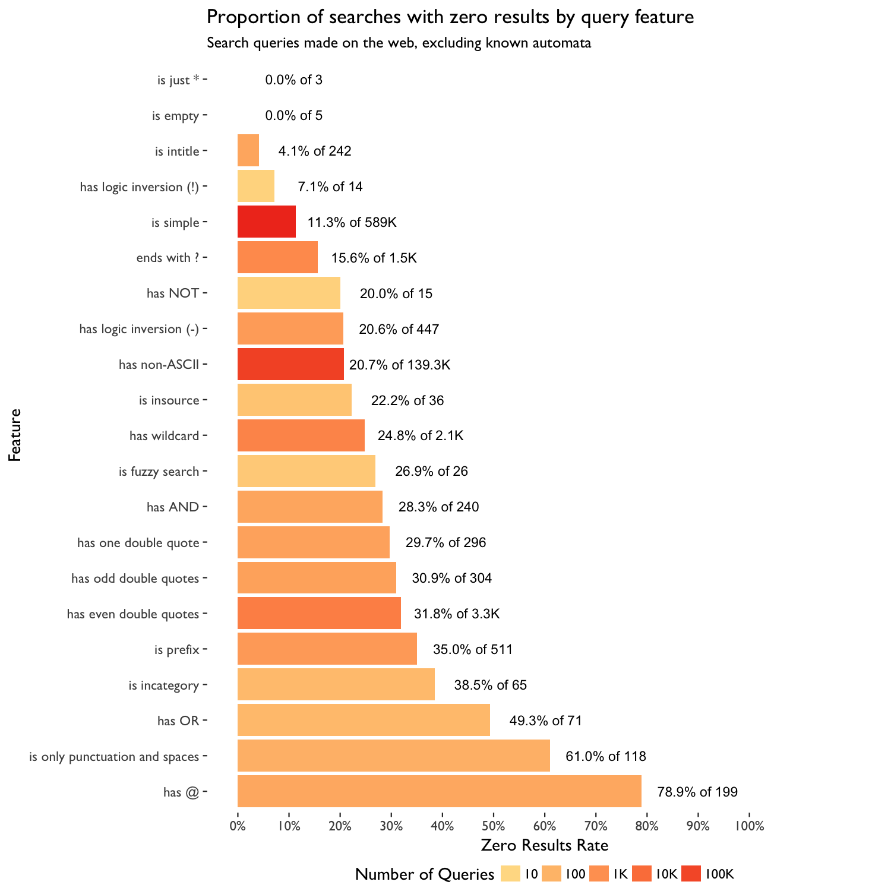
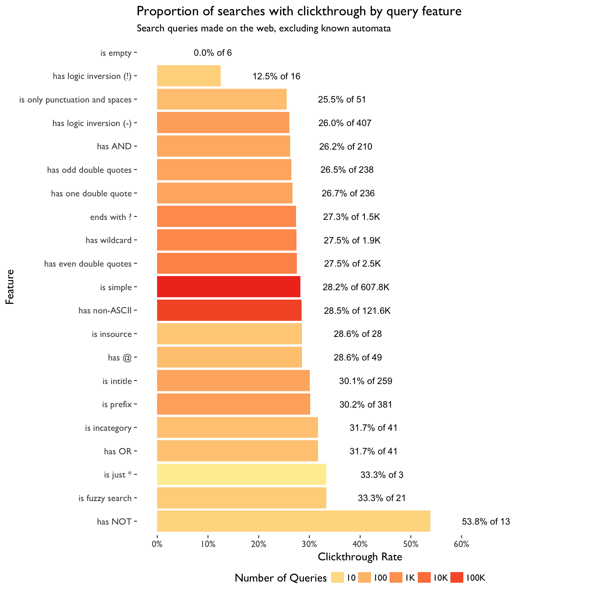
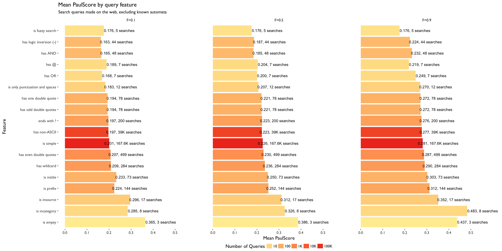

# Query Features and Search Performance
<a href = 'https://meta.wikimedia.org/wiki/User:CXie_(WMF)'>Chelsy Xie</a> (Analysis & Report)  
<a href = 'https://meta.wikimedia.org/wiki/User:DTankersley_(WMF)'>Deb Tankersley</a> (Product Management)  
<a href = 'https://meta.wikimedia.org/wiki/User:MPopov_(WMF)'>Mikhail Popov</a> (Review)  
<a href = 'https://meta.wikimedia.org/wiki/User:EBernhardson_(WMF)'>Erik Bernhardson</a> (Review)  
<a href = 'https://meta.wikimedia.org/wiki/User:TJones_(WMF)'>Trey Jones</a> (Review)  
<a href = 'https://www.mediawiki.org/wiki/User:DCausse_(WMF)'>David Causse</a> (Review)  
`r as.character(Sys.Date(), '%d %B %Y')`  
<!-- See: http://rmarkdown.rstudio.com/authoring_knitr_engines.html#javascript -->

{ <a href="https://github.com/wikimedia-research/Discovery-Search-QueryFeatures-201610/blob/master/docs/index.Rmd">RMarkdown Source</a> | <a href="https://github.com/wikimedia-research/Discovery-Search-QueryFeatures-201610">Analysis Codebase</a> | <a href="https://commons.wikimedia.org/wiki/File%3AQuery_Features_and_Search_Performance.pdf">PDF Version</a> }

## Executive Summary

Zero results rate (ZRR) -- the proportion of searches that yield zero results -- is a metric to measure the performance of our search system. In May 2016, we performed an [analysis](https://commons.wikimedia.org/wiki/File:From_Zero_to_Hero_-_Anticipating_Zero_Results_From_Query_Features,_Ignoring_Content.pdf) on zero result rate and query features using random forest and logistic regression model. This lead to us identifying question marks as the most important predictor of whether a query will yield zero results and lead to [us stripping question marks from queries](https://blog.wikimedia.org/2016/08/11/question-marks-search/). With this analysis, we wanted to see which features float up to the top now after eliminating the question mark. Furthermore, we also joined search satisfaction event logging data with our Cirrus search logs to investigate the relationship between query features and other search performance metrics: clickthrough rate and PaulScore.

We used random forest and generalized linear model with elastic net penalty to shed light on the relationship between query features and search performance metrics. For ZRR, we found that whether the query has an even number of double quotes, and whether it is only punctuation and spaces are more important than other features when predicting zero results. For clickthrough rate and PaulScore, we found that query features have very small predicting power.

## Data

A user has a 1 in 200 chance of being selected for search satisfaction tracking according to our [TestSearchSatisfaction2 #15700292](https://meta.wikimedia.org/w/index.php?title=Schema:TestSearchSatisfaction2&oldid=15700292) schema. We extracted the full-text web searching event logging data (excluding known automata) across all Wikimedia projects and languages from September 1st to October 23rd, and joined with [CirrusSearchRequestSet](https://wikitech.wikimedia.org/wiki/Analytics/Data/Cirrus). See [data_wTSS2.R](https://github.com/wikimedia-research/Discovery-Search-QueryFeatures-201610/blob/master/data_wTSS2.R) for more details.

We used a user-defined function (UDF) for deconstructing search queries into various features in Hive. The UDF detects a variety of features such as: odd or even number of quotation marks, logical operators (e.g. AND, OR), "prefix:" or "insource:", and wildcards. For a full list of features, please see [T118218](https://phabricator.wikimedia.org/T118218) and [SearchQuery.java](https://git.wikimedia.org/blob/analytics%2Frefinery%2Fsource.git/master/refinery-core%2Fsrc%2Fmain%2Fjava%2Forg%2Fwikimedia%2Fanalytics%2Frefinery%2Fcore%2FSearchQuery.java) and [SearchQueryFeatureRegex.java](https://git.wikimedia.org/blob/analytics%2Frefinery%2Fsource.git/master/refinery-core%2Fsrc%2Fmain%2Fjava%2Forg%2Fwikimedia%2Fanalytics%2Frefinery%2Fcore%2FSearchQueryFeatureRegex.java) source code.

An issue we noticed with the event logging is that when the user goes to the next page of search results or clicks the Back button after visiting a search result, a new page ID is generated for the search results page. The page ID is how we connect click events to search result page events. There is currently a Phabricator ticket ([T146337](https://phabricator.wikimedia.org/T146337)) for addressing these issues. For this analysis, we de-duplicated by connecting search engine results page (SERP) events that have the exact same search query, and then connected click events together based on the SERP connectivity. After de-duplicating, we collapsed all SERP and click events into 734,140 searches. See [refine_wTSS2.R](https://github.com/wikimedia-research/Discovery-Search-QueryFeatures-201610/blob/master/refine_wTSS2.R) for more details.

In this analysis, we used three search performance measures as our target variables: zero results rate, clickthrough rate and PaulScore. Zero results rate (ZRR) is the proportion of searches that yielded zero results (smaller is better, up to a point). Clickthrough rate is the proportion of searches that has at least one click on SERP (bigger is better). PaulScore is a metric of search results’ relevancy that relies on the position of the clicked result[s] (bigger is better); see [PaulScore Definition](https://wikimedia-research.github.io/Discovery-Search-Test-BM25/#paulscore-definition) for more details.

## Methods

We used [random forest](https://en.wikipedia.org/wiki/Random_forest) and [generalized linear model](https://en.wikipedia.org/wiki/Generalized_linear_model) (GLM) with [elastic net penalty](https://en.wikipedia.org/wiki/Elastic_net_regularization) to investigate the relationship between query features and search performance metrics. Random forest is an [ensemble classification](https://en.wikipedia.org/wiki/Ensemble_learning) algorithm, which is known to be good at dealing with large high-dimensional datasets with many categorical features, and is less prone to overfitting. It also enables us [to assess how important certain features are](https://en.wikipedia.org/wiki/Random_forest#Variable_importance) (through various variable importance measures) in classification. To compare with random forest, and to assess the magnitude and direction of a feature's impact, we also use logistic regression on predicting zero result and clickthrough, and linear regression on predicting PaulScore. We use the elastic net regularization when fitting the GLM, which allows for learning a sparse model where few of the weights are non-zero -- like Lasso -- while still maintaining the regularization properties of Ridge. We employed [10-fold cross validation](https://en.wikipedia.org/wiki/Cross-validation_(statistics)#k-fold_cross-validation) to find the optimal value of the penalty parameter.

For the two classification problems -- predicting zero result and clickthrough, both algorithms classify almost all data points into a single class because of the imbalanced data. To solve this problem, we performed down-sampling (deleted instances from the over-represented class) for logistic regression and stratified sampling for random forest for the training set, and use multiple metrics to measure model performance: accuracy, confusion matrix, and [area under ROC curve](https://en.wikipedia.org/wiki/Receiver_operating_characteristic#Area_under_the_curve) (AUC). Although down-sampling decreases the overall accuracy of the test set, we obtained a relatively balanced class error rate and higher AUC. It is worth noting that in this analysis, instead of prediction, our goal is to figure out the feature importance for zero results and zero clicks, so that we can highlight some features for potential work and improvement. Hence, the cost of wrongly classifying some results (clickthrough) as zero result (zero click) is less than the cost of wrongly classify zero result (zero click) as some results (clickthrough), and we should pay more attention to the accuracy of zero result and zero click, instead of the overall accuracy.

For random forest, we use the Mean Decrease Gini (MDI) and Mean Decrease Accuracy (MDA) to find the features which have the most impact on classification. MDA works such that if a variable $X_j$ is associated to response $Y$, then randomly permuting its values should result in a substantial decrease in the accuracy of the classification. Gini importance measures the average gain of purity by splits of a given variable. If the variable is useful, it tends to split mixed labeled nodes into pure single class nodes. Splitting by permuted variables tends neither to increase nor decrease node purities. Permuting a useful variable tends to give relatively large decrease in mean Gini-gain.

The design matrix consists of 21 dummy query features and 3 standardized continuous variables (number of terms, number of characters, and number of features detected). We considered including language (parsed from wiki ID) as a predictor but early parameter tuning tests showed that a very small increase in prediction accuracy was not enough to offset the time it would take to train. A random 80% subset of the data was used to train the model and the remaining 20% was used to test and measure the model performance.

## Results

### Exploratory Data Analysis

 

 

 

### Zero Result Rate

**Random Forest**: Overall accuracy of test set is 0.7056147, AUC is 0.7172. The confusion matrix is:

|              | some results | zero results | class error |
|:-------------|-------------:|-------------:|------------:|
| some results | 91057        | 36474        | 0.2860011   |
| zero results | 6750         | 12547        | 0.3497953   |

The following variable importance plot (Fig. 4) shows that "has even double quotes" and "is only punctuation and spaces" are more important than others when predicting zero result. 

**Logistic Regression**: The two tuned parameter of elastic net penalty are very closed to 0, which means logistic regression without penalty works best here. Overall accuracy of test set is 0.6946972, AUC is 0.6726. The confusion matrix is:

|              | some results | zero results | class error |
|:-------------|-------------:|-------------:|------------:|
| some results | 91441        | 36090        | 0.28299     |
| zero results | 8737         | 10560        | 0.45276     |

Fig. 5 below compares the features using the measures from both models to reveal which features the two models agree on. As before, we should pay more attention to MDA specific to queries with zero results. We can see that "has even double quotes" and "is only punctuation and spaces" are relatively more important and make zero result more likely.

### Clickthrough Rate

**Random Forest: ** Overall accuracy of test set is 0.4399294, AUC is 0.5004, which means the model is not very useful. The confusion matrix is:

|              | zero click | clickthrough | class error |
|:-------------|-----------:|-------------:|------------:|
| zero click   | 23986      | 61909        | 0.7207521   |
| clickthrough | 9444       | 32061        | 0.2275389   |

**Logistic Regression: ** Overall accuracy of test set is 0.4801099, AUC is 0.5314. The confusion matrix is:

|              | zero click | clickthrough | class error |
|:-------------|-----------:|-------------:|------------:|
| zero click   | 35255      | 50640        | 0.589557    |
| clickthrough | 15594      | 25911        | 0.375714   |

Because AUC is too close to 0.5, and the class error for zero click is too large, we do not think query features have large enough predictive power on clickthrough rate, and thus we are not reporting variable importance here (see appendix below).

### PaulScore

**Linear Regression: ** We fit linear regression models (lambdas of elastic net penalty are very close to 0) for PaulScore when scoring factor equals 0,1, 0.5 and 0.9. The explained deviance by models are very small, less than 0.3%, and R squared ranges from 0.005 to 0.009. Therefore, we do not think query features have enough predictive power on PaulScore, and thus we are not reporting variable importance here.

**Random Forest: ** Random forest regression did a little bit better than linear regression, but the performance measures are still too small: The R squared of test set are 0.014, 0.011 and 0.0013, the mean squared errors are 0.986, 0.989 and 0.999, for PaulScore when scoring factor equals 0,1, 0.5 and 0.9 respectively. Therefore, we do not think query features have enough predictive power on PaulScore, and thus we are not reporting variable importance here.

## Appendix

